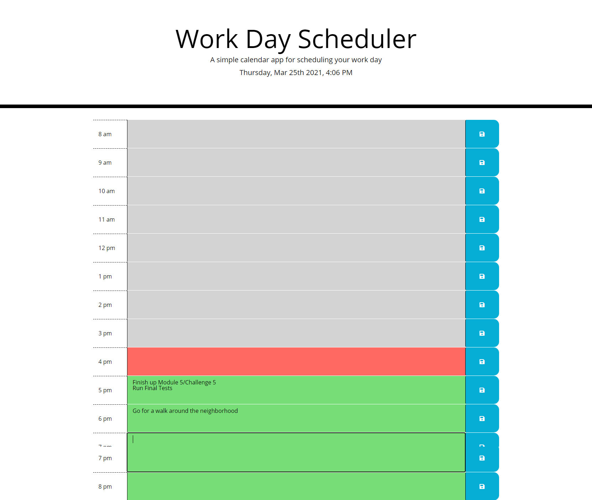

# Work Day Scheduler

## Description

A simple and quick webpage to manage your time throughout the day!
User will have the ability to add tasks to certain hours of the day.
To save the task, they must click the save button.
The saved information will be stored locally.
Webpage will refresh every 10 minutes.

Link to deployed website: https://jjmsantos.github.io/work-day-scheduler/

## User Story

- AS AN employee with a busy schedule
- I WANT to add important events to a daily planner
- SO THAT I can manage my time effectively

